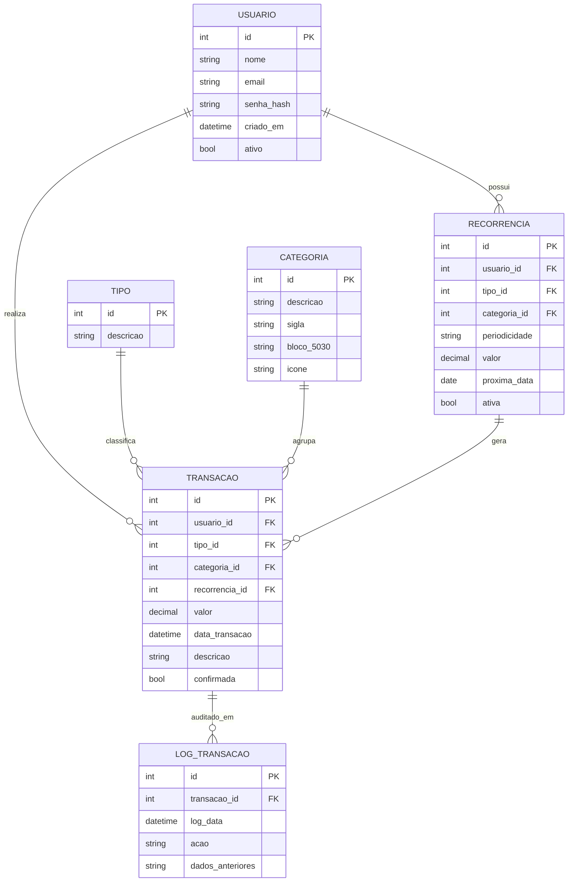
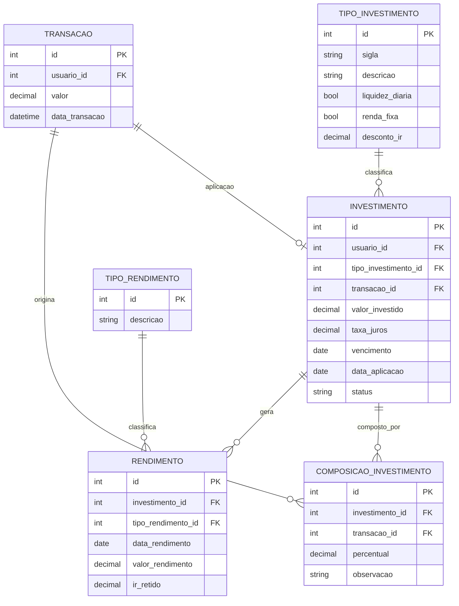
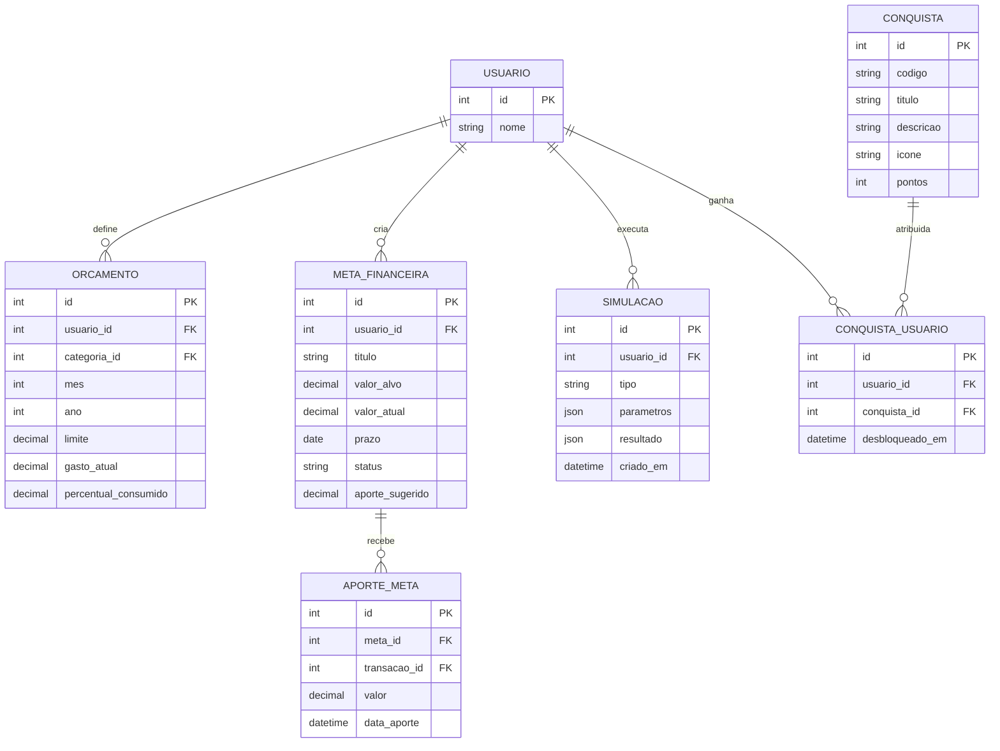
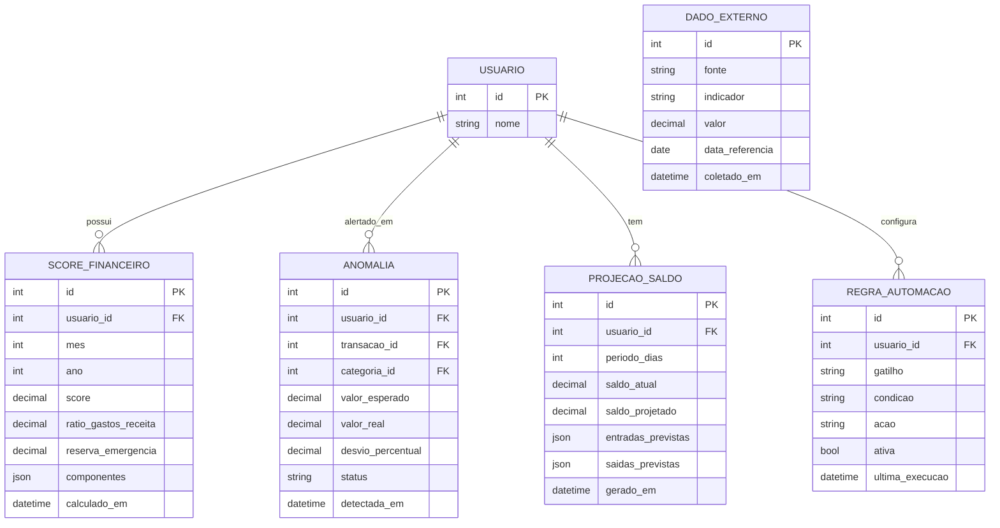
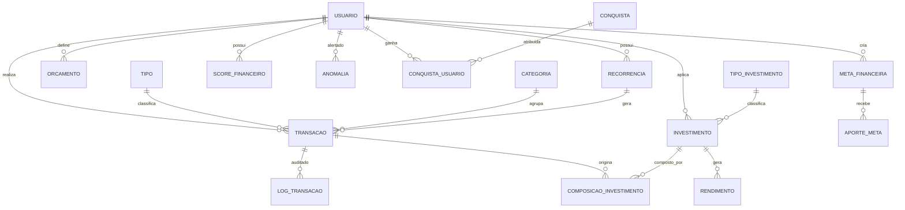

# DER — Sistema Financeiro Pessoal

Diagramas em Mermaid. Renderizam automaticamente no GitHub, GitLab, Notion e VSCode (extensão Markdown Preview Mermaid Support).

---

## Módulo 1 — Core financeiro

Entidades base: usuário, transação, tipo, categoria, recorrência e auditoria.

---

## Módulo 2 — Investimentos

Rastreabilidade entre transações e investimentos via `COMPOSICAO_INVESTIMENTO`.

---

## Módulo 3 — Planejamento

Orçamento por categoria, metas financeiras, simulações e gamificação.

---

## Módulo 4 — Análise & Inteligência

Score de saúde financeira, detecção de anomalias, projeções e dados externos.

---

## Visão geral (relacionamentos entre módulos)

